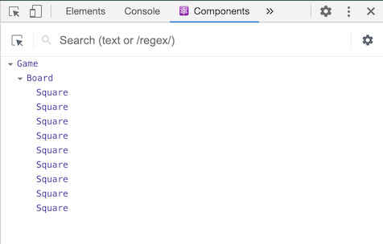

이 자습서는 React에 대한 어떤 지식도 가정하지 않습니다.

## 자습서를 시작하기 전에 {#before-we-start-the-tutorial}

우리는 이 자습서에서 작은 게임을 만들겁니다. **게임을 만들고 싶지 않아서 자습서를 건너뛰고 싶을 수 있습니다. 그래도 한번 해보세요!** 자습서를 통해 React 앱을 만드는 기본적인 사항들을 배웁니다. 이것을 마스터하면 React를 더 깊게 이해할 수 있습니다.

> 팁
>
> 자습서는 **실습으로 배우기**를 선호하는 사람들에 맞춰 설계되었습니다. 기초부터 개념을 학습하길 선호한다면 [단계별 가이드](/docs/hello-world.html)를 확인해보세요. 자습서와 단계별 가이드는 상호 보완적입니다.

자습서는 아래와 같이 몇 가지 부분으로 나뉘어 있습니다.

* [자습서 환경설정](#setup-for-the-tutorial)은 자습서를 따를 수 있는 **시작점**을 안내합니다.
* [개요](#overview)에서는 React의 **기본**(components, props, state)에 대해서 알아봅니다.
* [게임 완성하기](#completing-the-game)는 React 개발에서 사용하는 **가장 일반적인 테크닉**을 가르쳐 줄 것입니다.
* [시간여행 추가하기](#adding-time-travel)는 React의 고유한 강점에 대한 **깊은 통찰력**을 줄 것입니다.

자습서를 익히기 위해 모든 부분을 한 번에 완료할 필요는 없습니다. 한두 구역이라도 가능한 한 많이 시도해 보세요.

이 자습서를 따라 하기 위해 코드를 복사하여 붙여넣는 것도 괜찮지만 직접 코드를 따라 적기를 추천합니다. 이 방식은 몸으로 기억하는 것과 더 강한 이해에 도움을 줄 것입니다.

### 무엇을 만들게 될까요? {#what-are-we-building}

우리는 React로 대화형 틱택토 게임을 만드는 방법을 알려드릴 것입니다.

최종 결과물은 **[이 페이지](https://codepen.io/gaearon/pen/gWWZgR?editors=0010)**에서 확인할 수 있습니다. 코드가 이해가 되지 않거나 코드의 문법에 익숙하지 않더라도 걱정마세요! 자습서의 목적은 React와 React 문법에 대한 이해를 돕는 것입니다.

자습서를 진행하기 전에 틱택토 게임을 체험해보길 추천합니다. 주목할만한 특징 중 하나는 게임판 오른쪽에 번호가 매겨진 목록이 있다는 것입니다. 목록은 게임에서 일어난 모든 이동의 기록을 보여주며 게임을 진행하면 업데이트 됩니다.

틱택토 게임에 익숙해졌다면 종료해도 괜찮습니다. 우리는 자습서의 간단한 템플릿에서 시작할 것입니다. 다음 단계에서는 게임 구현을 시작하기 위한 설정을 다룹니다.

### 필요한 선수 지식 {#prerequisites}

HTML과 JavaScript에 어느 정도 익숙하다고 가정하지만 다른 프로그래밍 언어를 사용하더라도 자습서를 따라갈 수 있습니다. 또한 함수, 객체, 배열, 가능하다면 클래스 같은 프로그래밍 개념에 익숙하다고 가정합니다.

JavaScript를 다시 보고 싶다면 [이 가이드]( https://developer.mozilla.org/ko/docs/A_re-introduction_to_JavaScript)를 추천합니다. JavaScript의 최신 버전인 ES6의 몇 가지 기능을 사용한다는 사실에 주목해주세요. 자습서에서는 [화살표 함수](https://developer.mozilla.org/ko/docs/Web/JavaScript/Reference/Functions/애로우_펑션), [클래스](https://developer.mozilla.org/ko/docs/Web/JavaScript/Reference/Classes), [`let`](https://developer.mozilla.org/ko/docs/Web/JavaScript/Reference/Statements/let), [`const`](https://developer.mozilla.org/ko/docs/Web/JavaScript/Reference/Statements/const)를 사용합니다. [Babel REPL](babel://es5-syntax-example)을 사용하여 ES6 코드가 어떻게 컴파일되는지 확인할 수 있습니다.

## 자습서 환경설정 {#setup-for-the-tutorial}

자습서를 완성하는 방법에는 두 가지가 있습니다. 브라우저에서 코드를 작성해도 되고 컴퓨터에 로컬 개발 환경을 설정해도 됩니다.

### 선택 1: 브라우저에 코드 작성하기 {#setup-option-1-write-code-in-the-browser}

이 옵션은 가장 빠르게 시작하는 방식입니다!

먼저 새 탭에서 **[초기 코드](https://codepen.io/gaearon/pen/oWWQNa?editors=0010)**를 열어주세요. 새 탭은 비어있는 틱택토 게임판과 React 코드를 보여줄 것입니다. 우리는 자습서에서 React 코드를 편집할 것입니다.

이제 두 번째 설정 옵션을 건너뛰고 [개요](#overview) 단락으로 넘어가서 React에 대한 개요를 확인해주세요.

### 선택 2: 자신의 컴퓨터에서 코드 작성하기 {#setup-option-2-local-development-environment}

이 방식은 완전히 선택사항이며 이 자습서에 필요한 것은 아닙니다!

<br>

<details>

<summary><b>선택 사항: 선호하는 텍스트 편집기를 사용하기 위한 지침</b></summary>

이 설정에서는 더 많은 작업이 필요하지만, 선호하는 편집기를 사용하여 자습서를 완성할 수 있습니다. 아래의 단계를 따라주세요.

1. 최신 버전의 [Node.js](https://nodejs.org/en/)가 설치되어 있는지 확인해주세요.
2. [Create React App 설치 지침](/docs/create-a-new-react-app.html#create-react-app)을 따라 새로운 프로젝트를 생성해주세요.

```bash
npx create-react-app my-app
```

3. 새로운 프로젝트의 `src/` 폴더에 있는 모든 파일을 삭제해 주세요.

> 주의
>
> **`src` 폴더 전체가 아니라 폴더 내부의 기존 소스 파일들만 삭제해 주세요.** 다음 단계에서 기본 소스 파일을 이 프로젝트의 예시로 바꿀 것입니다.

```bash
cd my-app
cd src

# Mac 또는 Linux 사용자의 경우
rm -f *

# Windows 사용자
del *

# 다시 프로젝트 폴더로 돌아가세요.
cd ..
```

4. `src/` 폴더에 `index.css`라는 파일을 생성하고 [이 CSS 코드](https://codepen.io/gaearon/pen/oWWQNa?editors=0100)를 추가해주세요.

5. `src/` 폴더에 `index.js`라는 파일을 생성하고 [이 JS 코드](https://codepen.io/gaearon/pen/oWWQNa?editors=0010)를 추가해주세요.

6. 위에서 생성한 `index.js`의 상단에 아래 세 줄을 추가해주세요.

```js
import React from 'react';
import ReactDOM from 'react-dom';
import './index.css';
```

이제 프로젝트 폴더에서 `npm start` 명령어를 실행하고 브라우저에서 `http://localhost:3000`를 열면 비어있는 틱택토 필드를 확인할 수 있습니다.

에디터에서 구문 강조 표시를 설정하기 위해 [이 지침](https://babeljs.io/docs/editors/)을 따르길 권장합니다.

</details>

### 도움이 필요할 때! {#help-im-stuck}

막히는 부분이 생겼다면 [커뮤니티에서 지원하는 자료](/community/support.html)를 확인해보세요. 특히 [Reactiflux Chat](https://discord.gg/reactiflux)은 빠르게 도움을 받을 수 있는 좋은 방법입니다. 원하는 답을 얻지 못하거나 계속 막힌 상태라면 이슈를 제출해주세요. 우리가 도와드리겠습니다.

## 개요 {#overview}

이제 설정을 완료했으니 React의 개요를 살펴보겠습니다!

### React란 무엇인가요? {#what-is-react}

React는 사용자 인터페이스를 구축하기 위한 선언적이고 효율적이며 유연한 JavaScript 라이브러리입니다. "컴포넌트"라고 불리는 작고 고립된 코드의 파편을 이용하여 복잡한 UI를 구성하도록 돕습니다.

React는 몇 가지 종류의 컴포넌트를 가지지만 우리는 `React.Component`의 하위 클래스를 사용해보겠습니다.

```javascript
class ShoppingList extends React.Component {
  render() {
    return (
      <div className="shopping-list">
        <h1>Shopping List for {this.props.name}</h1>
        <ul>
          <li>Instagram</li>
          <li>WhatsApp</li>
          <li>Oculus</li>
        </ul>
      </div>
    );
  }
}

// 사용 예제: <ShoppingList name="Mark" />
```

XML과 유사한 재밌는 태그를 사용할 것입니다. 우리는 컴포넌트를 사용하여 React에게 화면에 표현하고 싶은 것이 무엇인지 알려줍니다. 데이터가 변경될 때 React는 컴포넌트를 효율적으로 업데이트하고 다시 렌더링합니다.

여기에서 ShoppingList는 **React 컴포넌트 클래스** 또는 **React 컴포넌트 타입**입니다. 개별 컴포넌트는 `props`라는 매개변수를 받아오고 `render` 함수를 통해 표시할 뷰 계층 구조를 반환합니다.

`render` 함수는 화면에서 보고자 하는 *내용*을 반환합니다. React는 설명을 전달받고 결과를 표시합니다. 특히 `render`는 렌더링할 내용을 경량화한 **React 엘리먼트**를 반환합니다. 다수의 React 개발자는 "JSX"라는 특수한 문법을 사용하여 React의 구조를 보다 쉽게 작성합니다. `<div />` 구문은 빌드하는 시점에서 `React.createElement('div')`로 변환됩니다. 위에서 본 예시는 아래와 같이 변화합니다.

```javascript
return React.createElement('div', {className: 'shopping-list'},
  React.createElement('h1', /* ... h1 children ... */),
  React.createElement('ul', /* ... ul children ... */)
);
```

[전체 코드는 여기서 확인해주세요.](babel://tutorial-expanded-version)

`createElement()`에 대해 궁금한 점이 있다면 [API 참조](/docs/react-api.html#createelement)에서 자세한 설명을 확인할 수 있습니다. 하지만 자습서에서는 이 방식이 아니라 JSX를 계속 사용할 것입니다.

JSX는 JavaScript의 강력한 기능을 가지고 있습니다. JSX 내부의 중괄호 안에 *어떤* JavaScript 표현식도 사용할 수 있습니다. React 엘리먼트는 JavaScript 객체이며 변수에 저장하거나 프로그램 여기저기에 전달할 수 있습니다.

`ShoppingList` 컴포넌트는 `<div />`와 `<li />` 같은 내각 DOM 컴포넌트만을 렌더링하지만 컴포넌트를 조합하여 커스텀 React 컴포넌트를 렌더링하는 것도 가능합니다. 예를 들어 `<ShoppingList />`를 작성하여 모든 쇼핑 목록을 참조할 수 있습니다. React 컴포넌트는 캡슐화되어 독립적으로 동작할 수 있습니다. 이러한 이유로 단순한 컴포넌트를 사용하여 복잡한 UI를 구현할 수 있습니다.

### 초기 코드 살펴보기 {#inspecting-the-starter-code}

**브라우저에서** 자습서 작성을 하는 경우 새 탭에서 **[초기 코드](https://codepen.io/gaearon/pen/oWWQNa?editors=0010)**를 열어주세요. **로컬 환경에서** 진행하는 경우 프로젝트 폴더에서 `src/index.js`를 열어주세요(이 파일은 [설정](#setup-option-2-local-development-environment)에서 다룬 적이 있습니다).

초기 코드는 제작할 틱택토의 기본 틀입니다. CSS 스타일은 제공되기 때문에 React를 배우는 것과 게임을 프로그래밍하는 데에만 집중하면 됩니다.

코드를 살펴보면 세 가지 React 컴포넌트를 확인할 수 있습니다.

* Square
* Board
* Game

Square 컴포넌트는 `<button>`을 렌더링하고 Board는 사각형 9개를 렌더링합니다. Game 컴포넌트는 게임판을 렌더링하며 나중에 수정할 자리 표시자 값을 가지고 있습니다. 지금은 사용자와 상호작용하는 컴포넌트가 없습니다.

### Props를 통해 데이터 전달하기 {#passing-data-through-props}

본격적으로 시작하기 위해 Board 컴포넌트에서 Square 컴포넌트로 데이터를 전달해 봅시다.

자습서를 따를 때 복사/붙여넣기가 아니라 손으로 직접 코드를 작성하길 추천합니다. 이렇게 하면 코드를 몸으로 기억하고 이해력을 더 높일 수 있습니다.

Square에 `value` prop을 전달하기 위해 Board의 `renderSquare` 함수 코드를 수정해주세요.

```js{3}
class Board extends React.Component {
  renderSquare(i) {
    return <Square value={i} />;
  }
}
```

값을 표시하기 위해 Square의 `render` 함수에서 `{/* TODO */}`를 `{this.props.value}`로 수정해주세요.

```js{5}
class Square extends React.Component {
  render() {
    return (
      <button className="square">
        {this.props.value}
      </button>
    );
  }
}
```

변경 전에는


변경 후에는 렌더링 된 결과에서 각 사각형에 숫자가 표시됩니다.


**[지금까지의 전체 코드 확인하기](https://codepen.io/gaearon/pen/aWWQOG?editors=0010)**

축하합니다! 부모 Board 컴포넌트에서 자식 Square 컴포넌트로 "prop을 전달"했습니다. props 전달하기는 React 앱에서 부모에서 자식으로 정보가 어떻게 흘러가는지 알려줍니다.

### 사용자와 상호작용하는 컴포넌트 만들기 {#making-an-interactive-component}

Square 컴포넌트를 클릭하면 "X"가 체크되도록 만들어봅시다.
먼저 Square 컴포넌트의 `render()` 함수에서 반환하는 버튼 태그를 아래와 같이 변경해주세요.

```javascript{4}
class Square extends React.Component {
  render() {
    return (
      <button className="square" onClick={function() { console.log('click'); }}>
        {this.props.value}
      </button>
    );
  }
}
```

Square를 클릭하면 'click'이 브라우저 개발자 도구의 콘솔에 출력되는 걸 확인할 수 있습니다.

> 주의
>
> 타이핑 횟수를 줄이고 [`this`의 혼란스러운 동작](https://yehudakatz.com/2011/08/11/understanding-javascript-function-invocation-and-this/)을 피하기 위해 아래부터는 이벤트 핸들러에 [화살표 함수](https://developer.mozilla.org/en-US/docs/Web/JavaScript/Reference/Functions/Arrow_functions)를 사용하겠습니다.
>
>```javascript{4}
>class Square extends React.Component {
>  render() {
>    return (
>      <button className="square" onClick={() => console.log('click')}>
>        {this.props.value}
>      </button>
>    );
>  }
>}
>```
>
> `onClick={() => console.log('click')}`이 어떻게 동작하는지 살펴보면 `onClick` prop으로 *함수*를 전달하고 있습니다. React는 클릭했을 때에만 이 함수를 호출할 것입니다. `() =>`을 잊어버리고 `onClick={console.log('click')}`이라고 작성하는 것은 자주 발생하는 실수이며 컴포넌트가 다시 렌더링할 때마다 경고 창을 띄울 것입니다.

다음 단계로 Square 컴포넌트를 클릭한 것을 "기억하게" 만들어 "X" 표시를 채워 넣으려고 합니다. 무언가를 "기억하기"위해 component는 **state**를 사용합니다.

React 컴포넌트는 생성자에 `this.state`를 설정하는 것으로 state를 가질 수 있습니다. `this.state`는 정의된 React 컴포넌트에 대해 비공개로 간주해야 합니다. 이제 Square의 현재 값을 `this.state`에 저장하고 Square를 클릭하는 경우 변경하겠습니다.

우선 클래스에 생성자를 추가하여 state를 초기화합니다.

```javascript{2-7}
class Square extends React.Component {
  constructor(props) {
    super(props);
    this.state = {
      value: null,
    };
  }

  render() {
    return (
      <button className="square" onClick={() => console.log('click')}>
        {this.props.value}
      </button>
    );
  }
}
```

> 주의
>
> [JavaScript 클래스](https://developer.mozilla.org/en-US/docs/Web/JavaScript/Reference/Classes)에서 하위 클래스의 생성자를 정의할 때 항상 `super`를 호출해야합니다. 모든 React 컴포넌트 클래스는 `생성자`를 가질 때 `super(props)` 호출 구문부터 작성해야 합니다.

이제 Square를 클릭할 때 현재 state 값을 표시하기 위해 `render` 함수를 변경할 것입니다.

* `<button>` 태그 안 `this.props.value`를 `this.state.value`로 변경해주세요.
* `onClick={...}` 이벤트 핸들러를 `onClick={() => this.setState({value: 'X'})}`로 변경해주세요.
* 가독성을 높이기 위해 `className`과 `onClick` props를 별도의 줄에 넣어주세요.

이와 같은 변경 후에 Square의 `render` 함수에서 반환하는 `<button>` 태그는 아래의 형태와 같습니다.

```javascript{12-13,15}
class Square extends React.Component {
  constructor(props) {
    super(props);
    this.state = {
      value: null,
    };
  }

  render() {
    return (
      <button
        className="square"
        onClick={() => this.setState({value: 'X'})}
      >
        {this.state.value}
      </button>
    );
  }
}
```

Square의 `render` 함수 내부에서 `onClick` 핸들러를 통해 `this.setState`를 호출하는 것으로 React에게 `<button>`을 클릭할 때 Square가 다시 렌더링해야 한다고 알릴 수 있습니다. 업데이트 이후에 Square의 `this.state.value`는 `'X'`가 되어 게임 판에서 `X`가 나타나는 것을 확인할 수 있습니다. 어떤 Square를 클릭하던 `X`가 나타날 것입니다.

컴포넌트에서 `setState`를 호출하면 React는 자동으로 컴포넌트 내부의 자식 컴포넌트 역시 업데이트합니다.

**[지금까지의 전체 코드 확인하기](https://codepen.io/gaearon/pen/VbbVLg?editors=0010)**

### 개발자 도구 {#developer-tools}

[Chrome](https://chrome.google.com/webstore/detail/react-developer-tools/fmkadmapgofadopljbjfkapdkoienihi?hl=en)과 [Firefox](https://addons.mozilla.org/en-US/firefox/addon/react-devtools/)의 React Devtools 확장 프로그램을 사용하면 브라우저 개발자 도구에서 React 컴포넌트 트리를 검사할 수 있습니다.



React DevTools를 통해 React 컴포넌트의 props와 state도 확인할 수 있습니다.

React DevTools를 설치한 후에 페이지의 모든 엘리먼트에 오른쪽 클릭을 하고 "요소 검사"를 클릭하여 개발자 도구를 열면 탭의 오른쪽 끝에 React 탭("⚛️ Components"와 "⚛️ Profiler")을 확인하실 수 있습니다. 컴포넌트 트리를 검사하고 싶다면 "⚛️ Components"를 사용해주세요.

**그러나 CodePen에서 도구를 사용하기 위해선 몇 가지 단계가 추가로 필요합니다.**

1. 로그인하세요. 또는 가입 후 이메일을 확인해주세요 (스팸 방지를 위해 필요).
2. "Fork" 버튼을 클릭하세요.
3. "Change View"를 클릭하여 "Debug mode"를 선택해주세요.
4. 새 탭이 열리면 개발자 도구에서 React 탭을 확인해주세요.

## 게임 완성하기 {#completing-the-game}

이제 틱택토 게임을 위한 기본 구성 요소를 가지고 있습니다. 완전한 게임을 위해 게임판의 "X"와 "O"를 번갈아 표시할 필요가 있으며 승자를 결정하는 방법이 필요합니다.

### State 끌어올리기 {#lifting-state-up}

현재 게임의 state를 각각의 Square 컴포넌트에서 유지하고 있습니다. 승자를 확인하기 위해 9개 사각형의 값을 한 곳에 유지할 것입니다.

Board가 각 Square에 Square의 state를 요청해야 한다고 생각할 수도 있습니다. 그리고 React에서 이런 접근이 가능하기는 하지만 이 방식은 코드를 이해하기 어렵게 만들고 버그에 취약하며 리팩토링이 어렵기 때문에 추천하지 않습니다. 각 Square가 아닌 부모 Board 컴포넌트에 게임의 상태를 저장하는 것이 가장 좋은 방법입니다. [각 Square에 숫자를 넘겨주었을 때와 같이](#passing-data-through-props) Board 컴포넌트는 각 Square에게 prop을 전달하는 것으로 무엇을 표시할 지 알려줍니다.

**여러개의 자식으로부터 데이터를 모으거나 두 개의 자식 컴포넌트들이 서로 통신하게 하려면 부모 컴포넌트에 공유 state를 정의해야 합니다. 부모 컴포넌트는 props를 사용하여 자식 컴포넌트에 state를 다시 전달할 수 있습니다. 이것은 자식 컴포넌트들이 서로 또는 부모 컴포넌트와 동기화 하도록 만듭니다.**

state를 부모 컴포넌트로 끌어올리는 것은 React 컴포넌트를 리팩토링할 때 흔히 사용합니다. 이번 기회에 시험해 보겠습니다.

Board에 생성자를 추가하고 9개의 사각형에 해당하는 9개의 null 배열을 초기 state로 설정해주세요.

```javascript{2-7}
class Board extends React.Component {
  constructor(props) {
    super(props);
    this.state = {
      squares: Array(9).fill(null),
    };
  }

  renderSquare(i) {
    return <Square value={i} />;
  }
```

나중에 board를 채우면 `this.state.squares` 배열은 아래와 같이 보일 것입니다.

```javascript
[
  'O', null, 'X',
  'X', 'X', 'O',
  'O', null, null,
]
```

Board의 `renderSquare` 함수는 현재 아래와 같은 형태입니다.

```javascript
  renderSquare(i) {
    return <Square value={i} />;
  }
```

처음에는 모든 Square에서 0부터 8까지 숫자를 보여주기 위해 Board에서 [`value` prop을 자식으로 전달했습니다](#passing-data-through-props). 또 다른 이전 단계에서는 숫자를 [Square의 자체 state에 따라](#making-an-interactive-component) "X" 표시로 바꾸었습니다. 그렇기 때문에 현재 Square는 Board에서 전달한 `value` prop을 무시하고 있습니다.

이제 prop을 전달하는 방법을 다시 사용할 것입니다. 각 Square에게 현재 값(`'X'`, `'O'`, 또는 `null`)을 표현하도록 Board를 수정할 것입니다. Board의 생성자에서 `squares` 배열을 이미 선언했으며 `renderSquare` 함수를 아래와 같이 수정할 것입니다.

```javascript{2}
  renderSquare(i) {
    return <Square value={this.state.squares[i]} />;
  }
```

**[지금까지의 전체 코드 확인하기](https://codepen.io/gaearon/pen/gWWQPY?editors=0010)**

Square는 이제 빈 사각형에 `'X'`, `'O'`, 또는 `null`인 `value` prop을 받습니다.

다음으로 Square를 클릭할 때 발생하는 변화가 필요합니다. Board 컴포넌트는 어떤 사각형이 채워졌는지를 여부를 관리하므로 Square가 Board를 변경할 방법이 필요합니다. 컴포넌트는 자신이 정의한 state에만 접근할 수 있으므로 Square에서 Board의 state를 직접 변경할 수 없습니다.

대신에 Board에서 Square로 함수를 전달하고 Square는 사각형을 클릭할 때 함수를 호출할 것입니다. 이제 Board의 `renderSquare` 함수를 아래와 같이 변경해주세요.

```javascript{5}
  renderSquare(i) {
    return (
      <Square
        value={this.state.squares[i]}
        onClick={() => this.handleClick(i)}
      />
    );
  }
```

> 주의
>
> 반환되는 엘리먼트를 여러 줄로 나누어 가독성을 확보하였고 괄호를 추가하여 JavaScript가 `return` 뒤에 세미콜론을 삽입하지 않아도 코드가 깨지지 않습니다.

이제 Board에서 Square로 `value`와 `onClick` 두 개의 props를 전달하였습니다. `onClick` prop은 Square를 클릭하면 호출되는 함수입니다. Square를 아래와 같이 변경해주세요.

* Square의 `render` 함수 내부의 `this.state.value`를 `this.props.value`로 바꾸어주세요.
* Square의 `render` 함수 내부의 `this.setState()`를 `this.props.onClick()`으로 바꾸어주세요.
* Square는 게임의 상태를 유지할 필요가 없기 때문에 `constructor`를 지워주세요.

이렇게 바꾼 후에 Square는 아래와 같은 모습이 됩니다.

```javascript{1,2,6,8}
class Square extends React.Component {
  render() {
    return (
      <button
        className="square"
        onClick={() => this.props.onClick()}
      >
        {this.props.value}
      </button>
    );
  }
}
```

Square를 클릭하면 Board에서 넘겨받은 `onClick` 함수가 호출됩니다. 이 때 일어나는 일을 정리해보겠습니다.

1. 내장된 DOM `<button>` 컴포넌트에 있는 `onClick` prop은 React에게 클릭 이벤트 리스너를 설정하라고 알려줍니다.
2. 버튼을 클릭하면 React는 Square의 `render()` 함수에 정의된 `onClick` 이벤트 핸들러를 호출합니다.
3. 이벤트 핸들러는 `this.props.onClick()`를 호출합니다. Square의 `onClick` prop은 Board에서 정의되었습니다.
4. Board에서 Square로 `onClick={() => this.handleClick(i)}`를 전달했기 때문에 Square를 클릭하면 Board의 `handleClick(i)`를 호출합니다.
5. 아직 `handleClick()`를 정의하지 않았기 때문에 코드가 깨질 것입니다. 지금은 사각형을 클릭하면 "this.handleClick is not a function"과 같은 내용을 표시하는 붉은 에러 화면을 보게됩니다.

> 주의
>
> DOM `<button>` 엘리먼트의 `onClick` 어트리뷰트는 내장된 컴포넌트라는 점에서 React에게 특별한 의미가 있습니다. Square같은 사용자 정의 컴포넌트의 경우 이름 지정은 자유롭습니다. Square의 `onClick` prop이나 Board의 `handleClick` 함수에는 어떤 이름도 붙일 수 있으며 코드는 동일하게 작동합니다. React에서 이벤트를 나타내는 prop에는 `on[Event]`, 이벤트를 처리하는 함수에는 `handle[Event]`를 사용하는 것이 일반적입니다.

`handleClick`을 아직 정의하지 않았기 때문에 Square를 클릭하려고 할 때 에러가 발생합니다. 이제 Board 클래스에 `handleClick`을 추가하겠습니다.

```javascript{9-13}
class Board extends React.Component {
  constructor(props) {
    super(props);
    this.state = {
      squares: Array(9).fill(null),
    };
  }

  handleClick(i) {
    const squares = this.state.squares.slice();
    squares[i] = 'X';
    this.setState({squares: squares});
  }

  renderSquare(i) {
    return (
      <Square
        value={this.state.squares[i]}
        onClick={() => this.handleClick(i)}
      />
    );
  }

  render() {
    const status = 'Next player: X';

    return (
      <div>
        <div className="status">{status}</div>
        <div className="board-row">
          {this.renderSquare(0)}
          {this.renderSquare(1)}
          {this.renderSquare(2)}
        </div>
        <div className="board-row">
          {this.renderSquare(3)}
          {this.renderSquare(4)}
          {this.renderSquare(5)}
        </div>
        <div className="board-row">
          {this.renderSquare(6)}
          {this.renderSquare(7)}
          {this.renderSquare(8)}
        </div>
      </div>
    );
  }
}
```

**[지금까지의 전체 코드 확인하기](https://codepen.io/gaearon/pen/ybbQJX?editors=0010)**

이제 이전과 마찬가지로 Square를 클릭하여 사각형을 채울 수 있습니다. 그러나 이제는 state가 각 Square 컴포넌트 대신에 Board 컴포넌트에 저장됩니다. Board의 상태가 변화할 때 Square 컴포넌트는 자동으로 다시 렌더링합니다. Board 컴포넌트의 모든 사각형의 상태를 유지하는 것으로 이후에 승자를 결정하는 것이 가능합니다.

Square 컴포넌트가 더 이상 state를 유지하지 않기 때문에 Square 컴포넌트는 Board 컴포넌트에서 값을 받아 클릭될 때 Board 컴포넌트로 정보를 전달합니다. React 용어로 Square 컴포넌트는 이제 **제어되는 컴포넌트**입니다. Board는 이들을 완전히 제어합니다.

`handleClick`에서는 `.slice()`를 호출하는 것으로 기존 배열을 수정하지 않고 `squares` 배열의 복사본을 생성하여 수정하는 것에 주의해주세요. 왜 `squares` 배열의 사본을 생성하였는지 다음 단락에서 설명하겠습니다.

### 불변성이 왜 중요할까요? {#why-immutability-is-important}

이전 코드 예시에서 기존 배열을 수정하는 것이 아니라 `.slice()` 연산자를 사용하여 `squares` 배열의 사본 만들기를 추천했습니다. 지금부터 불변성이 무엇인지와 왜 불변성이 중요한지 알아보겠습니다.

일반적으로 데이터 변경에는 두 가지 방법이 있습니다. 첫 번째는 데이터의 값을 직접 *변경*하는 것입니다. 두 번째는 원하는 변경 값을 가진 새로운 사본으로 데이터를 교체하는 것입니다.

#### 객체 변경을 통해 데이터 수정하기 {#data-change-with-mutation}

```javascript
var player = {score: 1, name: 'Jeff'};
player.score = 2;
// 이제 player는 {score: 2, name: 'Jeff'}입니다.
```

#### 객체 변경 없이 데이터 수정하기 {#data-change-without-mutation}

```javascript
var player = {score: 1, name: 'Jeff'};

var newPlayer = Object.assign({}, player, {score: 2});
// 이제 player는 변하지 않았지만 newPlayer는 {score: 2, name: 'Jeff'}입니다.

// 객체 spread 구문을 사용한다면 이렇게 쓸 수 있습니다.
// var newPlayer = {...player, score: 2};
```

최종 결과는 동일하지만 직접적인 객체 변경이나 기본 데이터의 변경을 하지 않는다면 아래에 기술된 몇 가지 이점을 얻을 수 있습니다.

#### 복잡한 특징들을 단순하게 만듦 {#complex-features-become-simple}

불변성은 복잡한 특징들을 구현하기 쉽게 만듭니다. 자습서에서는 "시간 여행" 기능을 구현하여 틱택토 게임의 이력을 확인하고 이전 동작으로 "되돌아갈 수 있습니다". 이 기능은 게임에만 국한되지 않습니다. 특정 행동을 취소하고 다시 실행하는 기능은 애플리케이션에서 일반적인 요구사항 입니다. 직접적인 데이터 변이를 피하는 것은 이전 버전의 게임 이력을 유지하고 나중에 재사용할 수 있게 만듭니다.

#### 변화를 감지함 {#detecting-changes}

객체가 직접적으로 수정되기 때문에 복제가 가능한 객체에서 변화를 감지하는 것은 어렵습니다. 감지는 복제가 가능한 객체를 이전 사본과 비교하고 전체 객체 트리를 돌아야 합니다.

불변 객체에서 변화를 감지하는 것은 상당히 쉽습니다. 참조하고 있는 불변 객체가 이전 객체와 다르다면 객체는 변한 것입니다.

#### React에서 다시 렌더링하는 시기를 결정함 {#determining-when-to-re-render-in-react}

불변성의 가장 큰 장점은 React에서 _순수 컴포넌트_를 만드는 데 도움을 준다는 것입니다. 변하지 않는 데이터는 변경이 이루어졌는지 쉽게 판단할 수 있으며 이를 바탕으로 컴포넌트가 다시 렌더링할지를 결정할 수 있습니다.

`shouldComponentUpdate()`와 *순수 컴포넌트*를 작성하는 법에 대해 더 알아보고 싶다면 [성능 최적화하기](/docs/optimizing-performance.html#examples)를 보세요.

### 함수 컴포넌트 {#function-components}

이제 Square를 **함수 컴포넌트**로 바꿔보겠습니다.

React에서 **함수 컴포넌트**는 더 간단하게 컴포넌트를 작성하는 방법이며 state 없이 `render` 함수만을 가집니다. `React.Component`를 확장하는 클래스를 정의하는 대신 `props`를 입력받아서 렌더링할 대상을 반환하는 함수를 작성할 수 있습니다. 함수 컴포넌트는 클래스로 작성하는 것보다 빠르게 작성할 수 있으며 많은 컴포넌트를 함수 컴포넌트로 표현할 수 있습니다.

Square 클래스를 아래의 함수로 바꿔보세요.

```javascript
function Square(props) {
  return (
    <button className="square" onClick={props.onClick}>
      {props.value}
    </button>
  );
}
```

모든 `this.props`를 `props`로 변경하였습니다.

**[지금까지의 전체 코드 확인하기](https://codepen.io/gaearon/pen/QvvJOv?editors=0010)**

> 주의
>
> Square를 함수 컴포넌트로 수정했을 때 `onClick={() => this.props.onClick()}`을 `onClick={props.onClick}`로 간결하게 작성했습니다. *양쪽* 모두 괄호가 사라진 것에 주목해주세요.

### 순서 만들기 {#taking-turns}

우리의 틱택토 게임이 가진 큰 문제점을 고칠 시간입니다. 게임판에서 "O"가 표시되지 않는 점이죠.

첫 번째 차례를 "X"로 시작하겠습니다. Board 생성자의 초기 state를 수정하는 것으로 기본값을 설정할 수 있습니다.

```javascript{6}
class Board extends React.Component {
  constructor(props) {
    super(props);
    this.state = {
      squares: Array(9).fill(null),
      xIsNext: true,
    };
  }
```

플레이어가 수를 둘 때마다 `xIsNext` (boolean 값)이 뒤집혀 다음 플레이어가 누군지 결정하고 게임의 state가 저장될 것입니다. Board의 `handleClick` 함수를 수정하여 `xIsNext` 값을 뒤집겠습니다.

```javascript{3,6}
  handleClick(i) {
    const squares = this.state.squares.slice();
    squares[i] = this.state.xIsNext ? 'X' : 'O';
    this.setState({
      squares: squares,
      xIsNext: !this.state.xIsNext,
    });
  }
```

이제 "X"와 "O"는 번갈아 나타납니다. 한 번 시도해보세요!

Board의 `render` 안에 있는 "status" 텍스트도 바꿔서 어느 플레이어가 다음 차례인지 알려주겠습니다.

```javascript{2}
  render() {
    const status = 'Next player: ' + (this.state.xIsNext ? 'X' : 'O');

    return (
      // 나머지는 그대로입니다.
```

변경사항을 적용하면 Board 컴포넌트는 다음과 같습니다.

```javascript{6,11-16,29}
class Board extends React.Component {
  constructor(props) {
    super(props);
    this.state = {
      squares: Array(9).fill(null),
      xIsNext: true,
    };
  }

  handleClick(i) {
    const squares = this.state.squares.slice();
    squares[i] = this.state.xIsNext ? 'X' : 'O';
    this.setState({
      squares: squares,
      xIsNext: !this.state.xIsNext,
    });
  }

  renderSquare(i) {
    return (
      <Square
        value={this.state.squares[i]}
        onClick={() => this.handleClick(i)}
      />
    );
  }

  render() {
    const status = 'Next player: ' + (this.state.xIsNext ? 'X' : 'O');

    return (
      <div>
        <div className="status">{status}</div>
        <div className="board-row">
          {this.renderSquare(0)}
          {this.renderSquare(1)}
          {this.renderSquare(2)}
        </div>
        <div className="board-row">
          {this.renderSquare(3)}
          {this.renderSquare(4)}
          {this.renderSquare(5)}
        </div>
        <div className="board-row">
          {this.renderSquare(6)}
          {this.renderSquare(7)}
          {this.renderSquare(8)}
        </div>
      </div>
    );
  }
}
```

**[지금까지의 전체 코드 확인하기](https://codepen.io/gaearon/pen/KmmrBy?editors=0010)**

### 승자 결정하기 {#declaring-a-winner}

이제 어떤 선수가 다음 차례인지 알려주었으니 승부가 나는 때와 더 이상 둘 곳이 없을 때를 알려주어야 합니다. 다음의 도우미 함수를 복사하여 파일 최하단에 붙여넣으세요.

```javascript
function calculateWinner(squares) {
  const lines = [
    [0, 1, 2],
    [3, 4, 5],
    [6, 7, 8],
    [0, 3, 6],
    [1, 4, 7],
    [2, 5, 8],
    [0, 4, 8],
    [2, 4, 6],
  ];
  for (let i = 0; i < lines.length; i++) {
    const [a, b, c] = lines[i];
    if (squares[a] && squares[a] === squares[b] && squares[a] === squares[c]) {
      return squares[a];
    }
  }
  return null;
}
```

9개의 사각형의 배열을 가지고 함수는 승자를 확인하여 적절한 값으로 `'X'`, `'O'`, 또는 `null`을 반환합니다.

어떤 플레이어가 우승했는지 확인하기 위해 Board의 `render` 함수에서 `calculateWinner(squares)`를 호출할 것입니다. 한 플레이어가 이긴다면 "Winner: X" 또는 "Winner: O" 같은 문구를 표시할 수 있습니다. Board의 `render` 함수에서 선언한 `status`를 아래 코드로 바꿔주세요.

```javascript{2-8}
  render() {
    const winner = calculateWinner(this.state.squares);
    let status;
    if (winner) {
      status = 'Winner: ' + winner;
    } else {
      status = 'Next player: ' + (this.state.xIsNext ? 'X' : 'O');
    }

    return (
      // 나머지는 그대로입니다.
```

누군가가 승리하거나 Square가 이미 채워졌다면 Board의 `handleClick` 함수가 클릭을 무시하도록 변경하겠습니다.

```javascript{3-5}
  handleClick(i) {
    const squares = this.state.squares.slice();
    if (calculateWinner(squares) || squares[i]) {
      return;
    }
    squares[i] = this.state.xIsNext ? 'X' : 'O';
    this.setState({
      squares: squares,
      xIsNext: !this.state.xIsNext,
    });
  }
```

**[지금까지의 전체 코드 확인하기](https://codepen.io/gaearon/pen/LyyXgK?editors=0010)**

축하합니다! 이제 제대로 동작하는 틱택토 게임을 만들었습니다. 그리고 React의 기본도 배웠습니다. 여기서 진정한 승자는 *여러분*인 것 같네요.

## 시간 여행 추가하기 {#adding-time-travel}

마지막 연습으로 경기에서 이전 차례로 "시간을 되돌리기"를 만들겠습니다.

### 동작에 대한 기록 저장하기 {#storing-a-history-of-moves}

`squares` 배열을 직접 변경했다면 시간 여행을 구현하기 어려웠을 것입니다.

하지만 `slice()`를 사용해서 매 동작 이후에 `squares` 배열의 새로운 복사본을 만들었고 [이를 불변 객체로 취급했습니다](#why-immutability-is-important). 이를 통해 과거의 `squares` 배열의 모든 버전을 저장하고 이미 지나간 차례를 탐색할 수 있습니다.

과거의 `squares` 배열들을 `history`라는 다른 배열에 저장할 것입니다. `history` 배열은 첫 동작부터 마지막 동작까지 모든 게임판의 상태를 표현하고 아래와 같은 형태입니다.

```javascript
history = [
  // 첫 동작이 발생하기 전
  {
    squares: [
      null, null, null,
      null, null, null,
      null, null, null,
    ]
  },
  // 첫 동작이 발생한 이후
  {
    squares: [
      null, null, null,
      null, 'X', null,
      null, null, null,
    ]
  },
  // 두 번째 동작이 발생한 이후
  {
    squares: [
      null, null, null,
      null, 'X', null,
      null, null, 'O',
    ]
  },
  // ...
]
```

이제 어떤 컴포넌트가 `history` state를 가지고 있을 지 결정해야 합니다.

### 다시 State 끌어올리기 {#lifting-state-up-again}

이전 동작에 대한 리스트를 보여주려면 최상위 단계의 Game 컴포넌트가 필요합니다. `history`를 이용해야하기 때문에 최상위 단계 Game 컴포넌트에 `history` state를 두겠습니다.

`history` state를 Game 컴포넌트에 두었기 때문에 자식 Board 컴포넌트에서 `squares` state를 더 이상 사용하지 않아도 됩니다. Square 컴포넌트에서 Board 컴포넌트로 ["state를 끌어올렸던 것"](#lifting-state-up) 처럼 이번에는 Board에서 최상위 단계 Game 컴포넌트로 state를 끌어올렸습니다. 이를 통해 Game 컴포넌트는 Board의 데이터를 완벽히 제어할 수 있으며 `history`에 저장된 과거의 차례를 Board가 렌더링 할 수 있게 만듭니다.

우선 Game 컴포넌트의 생성자 안에 초기 state를 설정해주세요.

```javascript{2-10}
class Game extends React.Component {
  constructor(props) {
    super(props);
    this.state = {
      history: [{
        squares: Array(9).fill(null),
      }],
      xIsNext: true,
    };
  }

  render() {
    return (
      <div className="game">
        <div className="game-board">
          <Board />
        </div>
        <div className="game-info">
          <div>{/* status */}</div>
          <ol>{/* TODO */}</ol>
        </div>
      </div>
    );
  }
}
```

다음으로 Game 컴포넌트에서 Board 컴포넌트로 `squares`와 `onClick` props를 전달하겠습니다. Board에서 여러 개의 Square에 쓰일 단일 클릭 핸들러를 가졌기 때문에 각 Square의 위치를 `onClick` 핸들러에게 넘겨주어 어떤 Square를 클릭했는지 표시할 것입니다. Board 컴포넌트를 변경하는 순서는 아래와 같습니다.

* `constructor`를 Board에서 제거해주세요.
* Board의 `renderSquare` 안의 `this.state.squares[i]`를 `this.props.squares[i]`로 바꿔주세요.
* Board의 `renderSquare` 안의 `this.handleClick(i)`을 `this.props.onClick(i)`으로 바꿔주세요.

이제 Board 컴포넌트는 아래와 같은 형태입니다.

```javascript{17,18}
class Board extends React.Component {
  handleClick(i) {
    const squares = this.state.squares.slice();
    if (calculateWinner(squares) || squares[i]) {
      return;
    }
    squares[i] = this.state.xIsNext ? 'X' : 'O';
    this.setState({
      squares: squares,
      xIsNext: !this.state.xIsNext,
    });
  }

  renderSquare(i) {
    return (
      <Square
        value={this.props.squares[i]}
        onClick={() => this.props.onClick(i)}
      />
    );
  }

  render() {
    const winner = calculateWinner(this.state.squares);
    let status;
    if (winner) {
      status = 'Winner: ' + winner;
    } else {
      status = 'Next player: ' + (this.state.xIsNext ? 'X' : 'O');
    }

    return (
      <div>
        <div className="status">{status}</div>
        <div className="board-row">
          {this.renderSquare(0)}
          {this.renderSquare(1)}
          {this.renderSquare(2)}
        </div>
        <div className="board-row">
          {this.renderSquare(3)}
          {this.renderSquare(4)}
          {this.renderSquare(5)}
        </div>
        <div className="board-row">
          {this.renderSquare(6)}
          {this.renderSquare(7)}
          {this.renderSquare(8)}
        </div>
      </div>
    );
  }
}
```

Game 컴포넌트의 `render` 함수를 가장 최근 기록을 사용하도록 업데이트하여 게임의 상태를 확인하고 표시하겠습니다.

```javascript{2-11,16-19,22}
  render() {
    const history = this.state.history;
    const current = history[history.length - 1];
    const winner = calculateWinner(current.squares);

    let status;
    if (winner) {
      status = 'Winner: ' + winner;
    } else {
      status = 'Next player: ' + (this.state.xIsNext ? 'X' : 'O');
    }

    return (
      <div className="game">
        <div className="game-board">
          <Board
            squares={current.squares}
            onClick={(i) => this.handleClick(i)}
          />
        </div>
        <div className="game-info">
          <div>{status}</div>
          <ol>{/* TODO */}</ol>
        </div>
      </div>
    );
  }
```

Game 컴포넌트가 게임의 상태를 렌더링하기 때문에 Board의 `render` 함수에서 중복되는 코드를 제거할 수 있습니다. 리펙토링 이후에 Board의 `render` 함수는 아래와 같습니다.

```js{1-4}
  render() {
    return (
      <div>
        <div className="board-row">
          {this.renderSquare(0)}
          {this.renderSquare(1)}
          {this.renderSquare(2)}
        </div>
        <div className="board-row">
          {this.renderSquare(3)}
          {this.renderSquare(4)}
          {this.renderSquare(5)}
        </div>
        <div className="board-row">
          {this.renderSquare(6)}
          {this.renderSquare(7)}
          {this.renderSquare(8)}
        </div>
      </div>
    );
  }
```

마지막으로 `handleClick` 함수를 Board에서 Game 컴포넌트로 이동하겠습니다. 또한 Game 컴포넌트의 state가 다르게 구성되어있기 때문에 `handleClick`을 수정해야 합니다. Game의 `handleClick` 함수에서 새로운 기록 목록을 `history`로 연결하겠습니다.

```javascript{2-4,10-12}
  handleClick(i) {
    const history = this.state.history;
    const current = history[history.length - 1];
    const squares = current.squares.slice();
    if (calculateWinner(squares) || squares[i]) {
      return;
    }
    squares[i] = this.state.xIsNext ? 'X' : 'O';
    this.setState({
      history: history.concat([{
        squares: squares,
      }]),
      xIsNext: !this.state.xIsNext,
    });
  }
```

> 주의
>
> 배열 `push()` 함수와 같이 더 익숙한 방식과 달리 `concat()` 함수는 기존 배열을 변경하지 않기 때문에 이를 더 권장합니다.

현재 시점에서 Board 컴포넌트는 `renderSquare`와 `render` 함수만을 필요로 합니다. 게임의 상태와 `handleClick` 함수는 Game 컴포넌트가 가지고 있어야 합니다.

**[지금까지의 전체 코드 확인하기](https://codepen.io/gaearon/pen/EmmOqJ?editors=0010)**

### 과거의 이동 표시하기 {#showing-the-past-moves}

틱택토 게임의 이동 정보를 기록하고 있기 때문에 이제 플레이어에게 과거의 이동을 목록으로 표시할 수 있습니다.

앞에서 React 엘리먼트는 애플리케이션에 전달할 수 있는 클래스형 JavaScript 객체라는 것을 배웠습니다. React 엘리먼트 배열을 사용하면 여러 아이템을 렌더링할 수 있습니다.

JavaScript에서 배열은 데이터를 다른 데이터와 함께 매핑할 때 사용하는 [`map()` 함수](https://developer.mozilla.org/en-US/docs/Web/JavaScript/Reference/Global_Objects/Array/map)를 가지고 있습니다. 이 함수는 아래와 같이 사용할 수 있습니다.

```js
const numbers = [1, 2, 3];
const doubled = numbers.map(x => x * 2); // [2, 4, 6]
```

`map` 함수를 사용하여 이동 기록을 화면에 표시되는 React 버튼 엘리먼트로 맵핑할 수 있으며 과거의 이동으로 "돌아가는" 버튼 목록을 표시할 수 있습니다.

게임의 `render` 함수에서 `history`를 `map` 해보겠습니다.

```javascript{6-15,34}
  render() {
    const history = this.state.history;
    const current = history[history.length - 1];
    const winner = calculateWinner(current.squares);

    const moves = history.map((step, move) => {
      const desc = move ?
        'Go to move #' + move :
        'Go to game start';
      return (
        <li>
          <button onClick={() => this.jumpTo(move)}>{desc}</button>
        </li>
      );
    });

    let status;
    if (winner) {
      status = 'Winner: ' + winner;
    } else {
      status = 'Next player: ' + (this.state.xIsNext ? 'X' : 'O');
    }

    return (
      <div className="game">
        <div className="game-board">
          <Board
            squares={current.squares}
            onClick={(i) => this.handleClick(i)}
          />
        </div>
        <div className="game-info">
          <div>{status}</div>
          <ol>{moves}</ol>
        </div>
      </div>
    );
  }
```

**[지금까지의 전체 코드 확인하기](https://codepen.io/gaearon/pen/EmmGEa?editors=0010)**

`history` 배열을 순회하면서 `step` 변수는 현재 `history` 요소의 값을 참조하며 `move`는 현재 `history` 요소의 인덱스를 참조합니다. 지금은 `move`에만 관심이 있으므로 `step`은 다른 곳에 할당되진 않습니다.

틱택토 게임 기록의 각각 이동마다 버튼 `<button>`을 포함하는 리스트 아이템 `<li>`를 생성합니다. 버튼은 `this.jumpTo()` 함수를 호출하는 `onClick` 핸들러를 가지고 있습니다. 아직은 `jumpTo()` 함수를 구현하지 않았습니다. 지금 상태에서 게임의 이동 목록은 아래와 같은 경고를 개발자 도구 콘솔에 표시합니다.

> 경고
> 배열이나 이터레이터의 자식들은 고유의 "key" prop을 가지고 있어야 합니다. "Game"의 render 함수를 확인해주세요.

위의 경고가 무엇을 의미하는지 얘기해봅시다.

### Key 선택하기 {#picking-a-key}

리스트를 렌더링할 때 React는 렌더링하는 리스트 아이템에 대한 정보를 저장합니다. 리스트를 업데이트 할 때 React는 무엇이 변했는 지 결정해야 합니다. 리스트의 아이템들은 추가, 제거, 재배열, 업데이트 될 수 있습니다.

아래의 코드가

```html
<li>Alexa: 7 tasks left</li>
<li>Ben: 5 tasks left</li>
```

다음과 같이 변한다고 상상해 봅시다.

```html
<li>Ben: 9 tasks left</li>
<li>Claudia: 8 tasks left</li>
<li>Alexa: 5 tasks left</li>
```

사람의 눈에는 task 개수가 업데이트되었을 뿐만 아니라 Alexa와 Ben의 순서가 바뀌고 Claudia가 두 사람 사이에 추가되었다고 생각할 것입니다. 그러나 React는 컴퓨터 프로그램이며 사람이 의도한 바가 무엇인지 알지 못합니다. 그렇기 때문에 리스트 아이템에 *key* prop을 지정하여 각 아이템이 다른 아이템들과 다르다는 것을 알려주어야 합니다. 키를 지정하는 한 가지 방법은 `alexa`, `ben`, `claudia` 문자를 사용하는 것입니다. 데이터베이스에서 데이터를 불러와서 표시한다면 Alexa, Ben, Claudia의 데이터베이스 ID가 키로 사용될 수 있습니다.

```html
<li key={user.id}>{user.name}: {user.taskCount} tasks left</li>
```

목록을 다시 렌더링하면 React는 각 리스트 아이템의 키를 가져가며 이전 리스트 아이템에서 일치하는 키를 탐색합니다. 현재 리스트에서 이전에 존재하지 않는 키를 가지고 있다면 React는 새로운 컴포넌트를 생성합니다. 현재 리스트가 이전 리스트에 존재했던 키를 가지고 있지 않다면 React는 그 키를 가진 컴포넌트를 제거합니다. 두 키가 일치한다면 해당 구성요소는 이동합니다. 키는 각 컴포넌트를 구별할 수 있도록 하여 React에게 다시 렌더링할 때 state를 유지할 수 있게 합니다. 컴포넌트의 키가 변한다면 컴포넌트는 제거되고 새로운 state와 함께 다시 생성됩니다.

React에서 `key`는 심화 기능인 `ref`와 동일하게 특별하고 미리 지정된 prop입니다. 엘리먼트가 생성되면 React는 `key` 속성을 추출하여 반환되는 엘리먼트에 직접 키를 저장합니다. `key`가 `props`에 속하는 것처럼 보이지만 `this.props.key`로 참조할 수 없습니다. React는 자동으로 `key`를 어떤 컴포넌트를 업데이트 할 지 판단하는 데에 사용합니다. 컴포넌트는 `key`를 조회할 수 없습니다.

**동적인 리스트를 만들 때마다 적절한 키를 할당할 것을 강력하게 추천합니다.** 적절한 키가 없는 경우 데이터 재구성을 고려해 볼 수 있습니다.

키가 지정되지 않은 경우 React는 경고를 표시하며 배열의 인덱스를 기본 키로 사용합니다. 배열의 인덱스를 키로 사용하는 것은 리스트 아이템 순서를 바꾸거나 아이템을 추가/제거 할 때 문제가 됩니다. 명시적으로 `key={i}`를 전달하면 경고가 나타나지는 않지만 동일한 문제를 일으키기 때문에 대부분의 경우에 추천하지 않습니다.

키는 전역에서 고유할 필요는 없으며 컴포넌트와 관련 아이템 사이에서는 고유한 값을 가져야 합니다.

### 시간 여행 구현하기 {#implementing-time-travel}

틱택토 게임의 기록에서 과거의 이동 정보는 이동의 순차적인 숫자를 고유한 ID로 가졌습니다. 이동은 순서가 바뀌거나 삭제되거나 중간에 삽입될 수 없기 때문에 이동의 인덱스를 키로 사용해도 안전합니다.

Game 컴포넌트의 `render` 함수 안에서 `<li key={move}>`로 키를 추가하면 React의 키에 대한 경고가 사라질 것입니다.

```js{6}
    const moves = history.map((step, move) => {
      const desc = move ?
        'Go to move #' + move :
        'Go to game start';
      return (
        <li key={move}>
          <button onClick={() => this.jumpTo(move)}>{desc}</button>
        </li>
      );
    });
```

**[지금까지의 전체 코드 확인하기](https://codepen.io/gaearon/pen/PmmXRE?editors=0010)**

`jumpTo` 함수가 정의되어있지 않기 때문에 리스트 아이템의 버튼을 클릭하면 에러가 발생합니다. `jumpTo`를 구현하기 전에 Game 컴포넌트의 state에 `stepNumber`를 추가하여 현재 진행 중인 단계를 표시하겠습니다.

먼저 Game의 `constructor` 초기 state로 `stepNumber: 0`을 추가해주세요.

```js{8}
class Game extends React.Component {
  constructor(props) {
    super(props);
    this.state = {
      history: [{
        squares: Array(9).fill(null),
      }],
      stepNumber: 0,
      xIsNext: true,
    };
  }
```

다음으로 Game의 `stepNumber`를 업데이트하기 위해 `jumpTo`를 정의해주세요. 또한 `stepNumber`가 짝수일 때 마다 `xIsNext`를 true로 설정하겠습니다.

```javascript{5-10}
  handleClick(i) {
    // 이 함수는 변하지 않습니다.
  }

  jumpTo(step) {
    this.setState({
      stepNumber: step,
      xIsNext: (step % 2) === 0,
    });
  }

  render() {
    // 이 함수는 변하지 않습니다.
  }
```

Notice in `jumpTo` method, we haven't updated `history` property of the state. That is because state updates are merged or in more simple words React will update only the properties mentioned in `setState` method leaving the remaining state as is. For more info **[see the documentation](/docs/state-and-lifecycle.html#state-updates-are-merged)**.

이제 사각형을 클릭할 때 마다 실행되는 Game의 `handleClick` 함수에 몇 가지 변화를 줄 것입니다.

`stepNumber` state는 현재 사용자에게 표시되는 이동을 반영합니다. 새로운 이동을 만든 후에 `this.setState`의 인자로 `stepNumber: history.length`를 추가하여 `stepNumber`를 업데이트 해아합니다. 이를 통해 새로운 이동이 생성된 후에 이동이 그대로 남아있는 것을 방지합니다.

We will also replace reading `this.state.history` with `this.state.history.slice(0, this.state.stepNumber + 1)`. This ensures that if we "go back in time" and then make a new move from that point, we throw away all the "future" history that would now be incorrect.

```javascript{2,13}
  handleClick(i) {
    const history = this.state.history.slice(0, this.state.stepNumber + 1);
    const current = history[history.length - 1];
    const squares = current.squares.slice();
    if (calculateWinner(squares) || squares[i]) {
      return;
    }
    squares[i] = this.state.xIsNext ? 'X' : 'O';
    this.setState({
      history: history.concat([{
        squares: squares
      }]),
      stepNumber: history.length,
      xIsNext: !this.state.xIsNext,
    });
  }
```

마지막으로 Game 컴포넌트의 `render` 함수를 수정하여 항상 마지막 이동을 렌더링하는 대신 `stepNumber`에 맞는 현재 선택된 이동을 렌더링할 것입니다.

```javascript{3}
  render() {
    const history = this.state.history;
    const current = history[this.state.stepNumber];
    const winner = calculateWinner(current.squares);

    // the rest has not changed
```

게임의 기록에서 어떤 차례를 선택한다면 틱택토 게임판을 즉시 업데이트해서 그 단계가 발생한 직후의 게임판을 보여주어야 합니다.

**[지금까지의 전체 코드 확인하기](https://codepen.io/gaearon/pen/gWWZgR?editors=0010)**

### 마무리 {#wrapping-up}

축하합니다! 아래 기능을 가진 틱택토 게임을 만들었습니다.

* 틱택토를 할 수 있게 해주고,
* 게임에서 승리했을 때를 알려주며,
* 게임이 진행됨에 따라 게임 기록을 저장하고,
* 플레이어가 게임 기록을 확인하고 게임판의 이전 버전을 볼 수 있도록 허용합니다.

수고하셨습니다! 이제 React가 어떻게 동작하는지 이해하셨길 바랍니다.

최종 결과는 여기서 확인해주세요: **[최종 결과](https://codepen.io/gaearon/pen/gWWZgR?editors=0010)**.

시간이 더 있거나 새로운 React 기술을 연습하고 싶은 경우 다음과 같이 난이도를 높일 수 있는 틱택토 게임 개선 아이디어를 구현해보세요.

1. 이동 기록 목록에서 특정 형식(행, 열)으로 각 이동의 위치를 표시해주세요.
2. 이동 목록에서 현재 선택된 아이템을 굵게 표시해주세요.
3. 사각형들을 만들 때 하드코딩 대신에 두 개의 반복문을 사용하도록 Board를 다시 작성해주세요.
4. 오름차순이나 내림차순으로 이동을 정렬하도록 토글 버튼을 추가해주세요.
5. 승자가 정해지면 승부의 원인이 된 세 개의 사각형을 강조해주세요.
6. 승자가 없는 경우 무승부라는 메시지를 표시해주세요.

자습서를 통해 엘리먼트, 컴포넌트, props, state를 포함한 React의 개념을 다루었습니다. 각 항목에 대한 자세한 설명은 [문서의 다른 부분](/docs/hello-world.html)을 참조하시길 바랍니다. 컴포넌트의 정의에 대한 자세한 내용은 [`React.Component` API 참조](/docs/react-component.html)를 확인해주세요.
